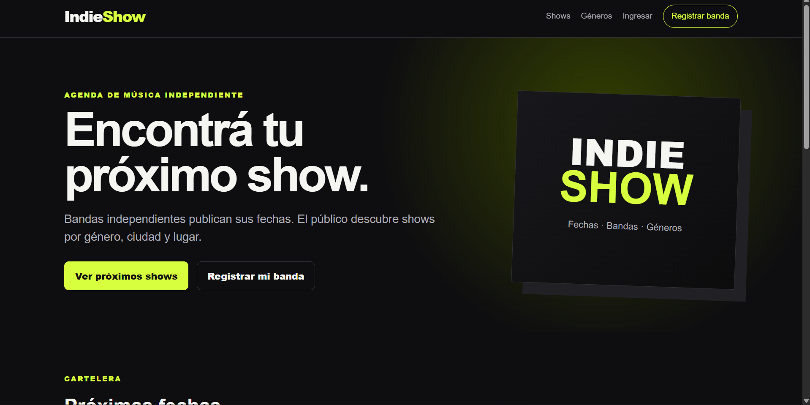
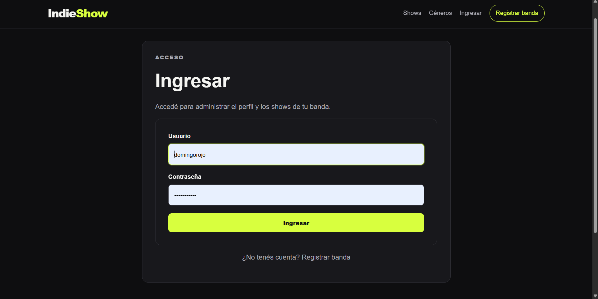
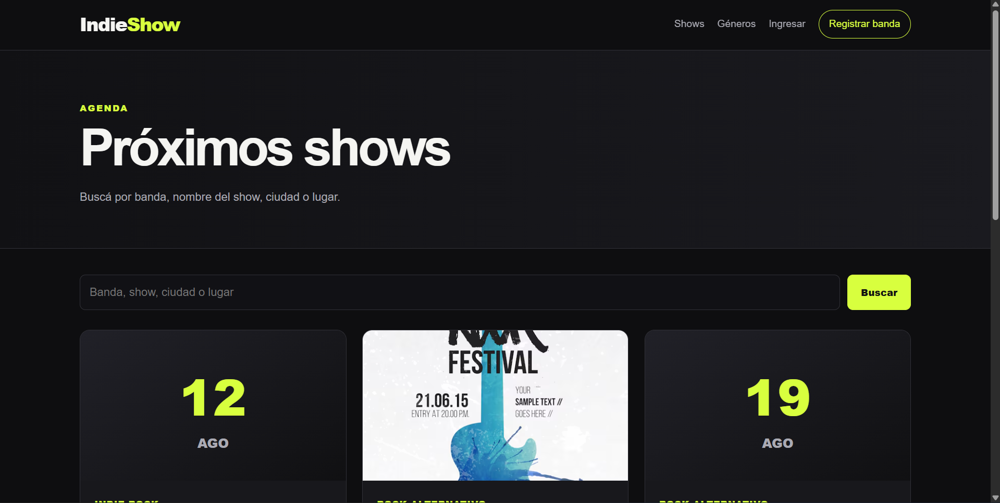
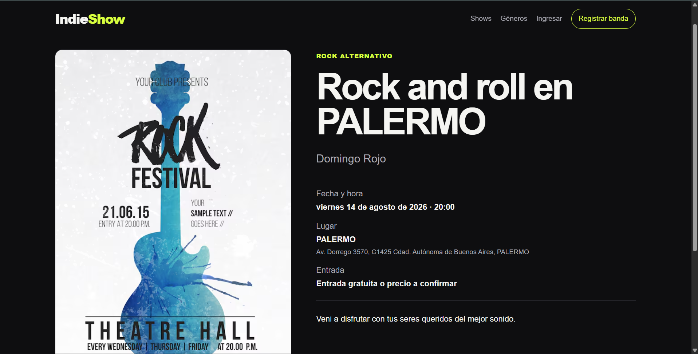
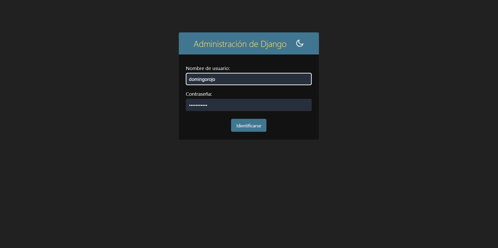
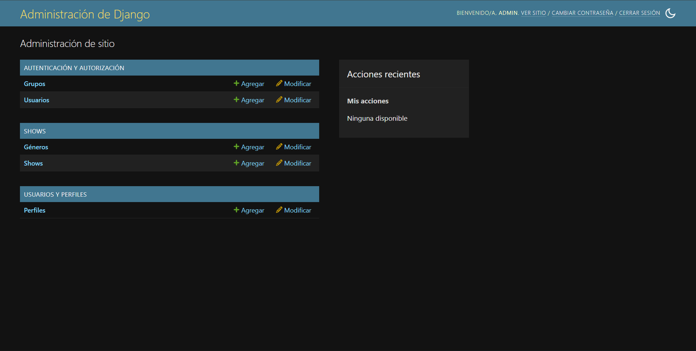
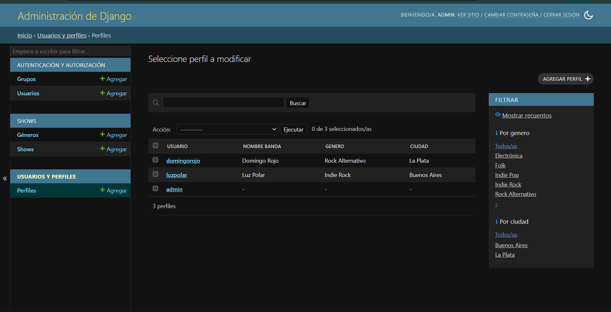

# IndieShow

IndieShow es una aplicación web MVP desarrollada con Django para publicar y descubrir shows de bandas independientes. Las bandas pueden registrarse, completar su perfil y administrar sus propias fechas. Los visitantes pueden recorrer la agenda, buscar shows y filtrar por género musical.

## Propósito

Las fechas de bandas independientes suelen quedar dispersas entre redes sociales y publicaciones temporales. IndieShow centraliza esa información en una agenda simple, pública y organizada.

## Funcionalidades

- Inicio con próximos shows.
- Listado público de shows.
- Búsqueda por banda, título, ciudad o lugar.
- Filtro de shows por género musical.
- Detalle con fecha, hora, lugar, dirección, precio y enlace de entradas.
- Registro, inicio y cierre de sesión.
- Perfil editable para cada banda.
- Creación, edición y eliminación de shows.
- Validación de fechas, precio, título, descripción y email.
- Restricción para que cada usuario modifique únicamente sus shows.
- Panel administrativo de Django.
- Acciones masivas para publicar u ocultar shows desde el admin.
- Archivos estáticos y media configurados.
- Configuración básica para despliegue con Gunicorn y WhiteNoise.
- Pruebas automáticas básicas.

## Tecnologías

- Python 3.12 o superior.
- Django 6.0.8.
- SQLite.
- HTML y CSS.
- Pillow para imágenes.
- WhiteNoise y Gunicorn para una preparación básica de despliegue.

## Instalación manual

### 1. Crear el entorno virtual

Windows:

```bash
python -m venv .venv
.venv\Scripts\activate
```

Linux o macOS:

```bash
python3 -m venv .venv
source .venv/bin/activate
```

### 2. Instalar dependencias

```bash
python -m pip install --upgrade pip
python -m pip install -r requirements.txt
```

### 3. Crear la base de datos

```bash
python manage.py migrate
```

### 4. Cargar datos de demostración

```bash
python manage.py cargar_demo
```

### 5. Ejecutar el servidor

```bash
python manage.py runserver
```

Abrir en el navegador:

```text
http://127.0.0.1:8000/
```

## Usuarios de demostración

### Administrador

```text
Usuario: admin
Contraseña: Admin12345!
```

Panel administrativo:

```text
http://127.0.0.1:8000/admin/
```

### Bandas

```text
Usuario: luzpolar
Contraseña: Indie12345!
```

```text
Usuario: domingorojo
Contraseña: Indie12345!
```

Las credenciales son únicamente para demostración y deben cambiarse en un despliegue real.

## Archivos estáticos

Para preparar los archivos estáticos:

```bash
python manage.py collectstatic --noinput
```

Los archivos se guardan en `staticfiles/`.

## Variables de entorno

Se incluye `.env.example` como referencia. Las variables principales son:

```text
SECRET_KEY
DEBUG
ALLOWED_HOSTS
CSRF_TRUSTED_ORIGINS
```

## Estructura principal

```text
IndieShow/
├── indieshow/             Configuración general del proyecto
├── shows/                 Géneros, shows, formularios y vistas
├── usuarios/              Registro y perfiles de bandas
├── templates/             Templates HTML
├── static/                Estilos
├── media/                 Flyers y logos cargados
├── docs/                  Guías para pruebas y presentación
├── manage.py
├── requirements.txt
├── render.yaml
└── README.md
```
## Evidencia visual

A continuación se presentan capturas de las principales funcionalidades de IndieShow.

### Página de inicio

La página principal muestra la identidad del proyecto y permite acceder a la agenda de shows, iniciar sesión y navegar por las distintas secciones de la aplicación.



### Inicio de sesión de usuarios

Los usuarios registrados pueden iniciar sesión para administrar el perfil de su banda y publicar sus próximos shows.



### Panel de shows

Desde este panel, cada usuario puede consultar los shows asociados a su banda y acceder a las opciones disponibles para administrar el contenido.



### Detalle de un show

Cada publicación cuenta con una página de detalle donde se muestran los datos principales del evento, como la banda, fecha, horario, lugar, ciudad, género musical y descripción.



### Inicio de sesión del administrador

Django proporciona un acceso independiente al panel administrativo para los usuarios autorizados.



### Panel de administración

Desde el panel de Django Admin es posible gestionar usuarios, bandas, géneros musicales y shows registrados en la aplicación.



### Modificación de contenido desde el administrador

Los administradores pueden consultar y modificar la información almacenada en la aplicación mediante los formularios del panel administrativo.



## Autor

Yair Eduardo Bataglia.
